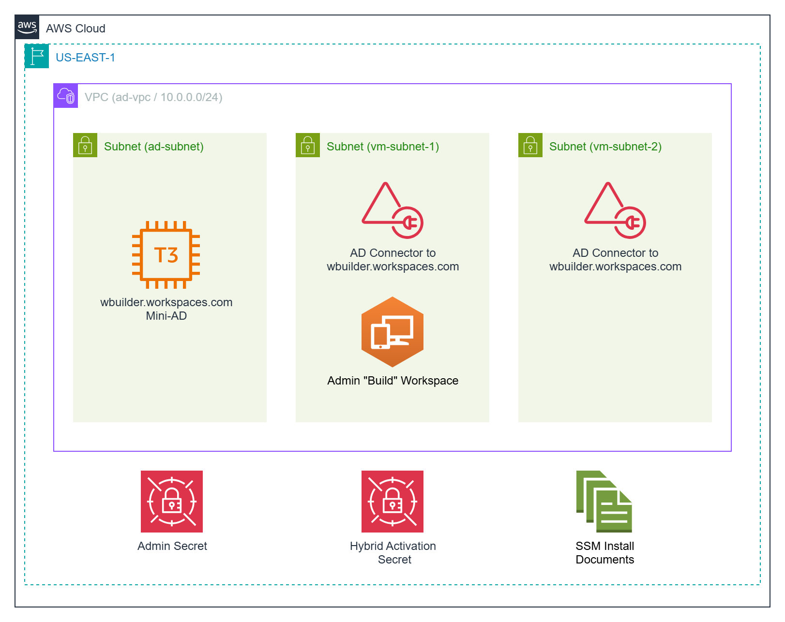
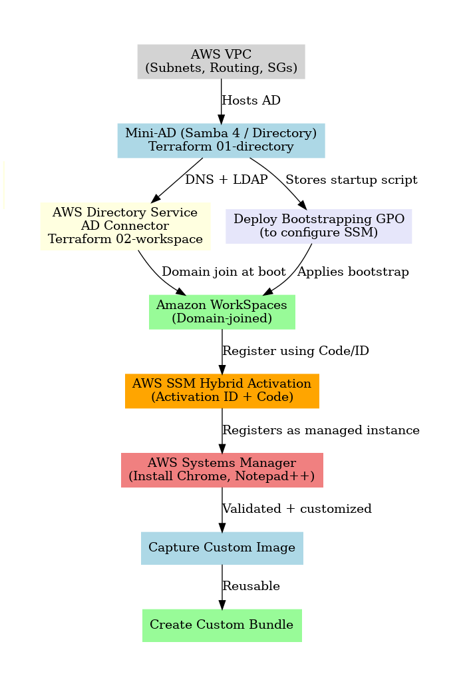

# AWS Workspace Builder (WBuilder)

## Overview
AWS Workspace Builder is a **Packer-like automation tool** for **building custom AWS WorkSpaces images and bundles**.  
Instead of manually launching a WorkSpace, installing software, and capturing an image, this project provides an automated pipeline that:

1. Launches a WorkSpace from an AWS-provided base image.  
2. Uses AWS Systems Manager (SSM) to install additional software (e.g., Chrome, Notepad++).  
3. Validates the environment.  
4. Captures a **custom image**.  
5. Creates a **custom WorkSpace bundle** based on that image.  

The result is a reproducible, versioned image + bundle that can be reused across deployments.


## Key Features
- **Packer-like workflow** for WorkSpaces.  
- Starts with AWS-provided base images.  
- Installs software via **SSM automation documents**.  
- Produces validated **golden images** and **custom bundles**.  
- Fully automated with **Terraform + Bash scripts**.  

## Project Structure
```text
aws-workspace-builder-main/
├── apply.sh              # End-to-end deploy + build wrapper
├── destroy.sh            # Cleanup environment
├── check_env.sh          # Pre-flight validation
├── validate.sh           # Post-install validation checks
├── build_bundle.sh       # Capture image + create WorkSpace bundle
├── ssm-wait.sh           # Wait for SSM agent readiness
│
├── 01-directory/         # Mini-AD + networking + IAM (Terraform)
├── 02-workspace/         # WorkSpace + AD Connector (Terraform)
├── 03-ssm/               # SSM automation (Chrome, Notepad++ installs)
```

## AWS Diagram of WBuilder Environment



## Build Workflow



1. **Environment pre-check**  
   ```bash
   ./check_env.sh
   ```

2. **Deploy Mini-AD + networking**  
   ```bash
   cd 01-directory
   terraform init && terraform apply
   ```

3. **Deploy WorkSpace + AD Connector**  
   ```bash
   cd ../02-workspace
   terraform init && terraform apply
   ```

4. **Wait for SSM agent**  
   ```bash
   ./ssm-wait.sh
   ```

5. **Install software via SSM**  
   ```bash
   cd 03-ssm
   ./ssm-execute.sh
   ```

6. **Validate installation**  
   ```bash
   ./validate.sh
   ```

7. **Capture custom image + bundle**  
   ```bash
   ./build_bundle.sh
   ```

8. **Tear down environment (optional)**  
   ```bash
   ./destroy.sh
   ```

## Prerequisites

* [An AWS Account](https://aws.amazon.com/console/)
* [Install AWS CLI](https://docs.aws.amazon.com/cli/latest/userguide/getting-started-install.html) 
* [Install Latest Terraform](https://developer.hashicorp.com/terraform/install)
* [Install a Workspaces Client](https://clients.amazonworkspaces.com/)

If this is your first time watching our content, we recommend starting with this video: [AWS + Terraform: Easy Setup](https://youtu.be/BCMQo0CB9wk). It provides a step-by-step guide to properly configure Terraform, Packer, and the AWS CLI.  


## Download this Repository

```bash
git clone https://github.com/mamonaco1973/aws-workspace-builder.git
cd aws-workspace-builder
```


## Build the Code

Run [check_env](check_env.sh) to validate your environment, then run [apply](apply.sh) to provision the infrastructure.

```bash
develop-vm:~/aws-workspace-builder$ ./apply.sh
NOTE: Validating that required commands are found in your PATH.
NOTE: aws is found in the current PATH.
NOTE: terraform is found in the current PATH.
NOTE: All required commands are available.
NOTE: Checking AWS cli connection.
NOTE: Successfully logged into AWS.
Initializing the backend...
Initializing provider plugins...
- Reusing previous version of hashicorp/random from the dependency lock file
- Reusing previous version of hashicorp/aws from the dependency lock file
- Using previously-installed hashicorp/random v3.7.1
- Using previously-installed hashicorp/aws v5.89.0

Terraform has been successfully initialized!

You may now begin working with Terraform. Try running "terraform plan" to see
any changes that are required for your infrastructure. All Terraform commands
should now work.
```

## Build Results

When this project is applied, it provisions the following AWS resources and artifacts:

- **Active Directory Environment (01-directory)**
  - Minimal AD deployment (“mini-ad”) with supporting roles
  - VPC networking for directory integration
  - Security groups, IAM roles, and activation resources
  - Automation scripts for directory setup

- **WorkSpaces Environment (02-workspace)**
  - WorkSpaces directory connector
  - Workspace definitions and configuration
  - Variables to parameterize bundles and user assignments

- **Systems Manager Integration (03-ssm)**
  - Pre-built SSM documents for automated software installation:
    - `adtools.json` – installs Active Directory tools  
    - `chrome.json` – installs Google Chrome  
    - `npp.json` – installs Notepad++  
  - Shell scripts to build, execute, and manage SSM automation against WorkSpaces

## Demo

In this demo, we will:

1. Log in to the `Admin` workspace.  
2. Create a new SSM JSON document to install [7-Zip](https://www.7-zip.org).  


```json
{
  "schemaVersion": "2.2",
  "description": "Download and silently install 7-Zip",
  "mainSteps": [
    {
      "action": "aws:runPowerShellScript",
      "name": "Install7Zip",
      "inputs": {
        "runCommand": [
          "$ErrorActionPreference = 'Stop'",
          "",
          "$LocalTempDir = $env:TEMP",
          "$Installer   = '7z_installer.exe'",
          "$DownloadUrl = 'https://www.7-zip.org/a/7z2301-x64.exe'",
          "",
          "# Disable progress bar for faster/silent download",
          "$ProgressPreference = 'SilentlyContinue'",
          "",
          "Write-Output 'Downloading 7-Zip installer...'",
          "try {",
          "  Invoke-WebRequest -Uri $DownloadUrl -OutFile \"$LocalTempDir\\$Installer\" -UseBasicParsing",
          "} catch {",
          "  Write-Output \"ERROR: Failed to download 7-Zip: $($_.Exception.Message)\"",
          "  exit 1",
          "}",
          "",
          "Write-Output 'Installing 7-Zip silently...'",
          "try {",
          "  Start-Process -FilePath \"$LocalTempDir\\$Installer\" -ArgumentList '/S' -Wait -NoNewWindow",
          "} catch {",
          "  Write-Output \"ERROR: Failed to install 7-Zip: $($_.Exception.Message)\"",
          "  exit 1",
          "}",
          "",
          "Write-Output '7-Zip installation complete.'"
        ]
      }
    }
  ]
}
```

3. Execute the SSM document to deploy 7-Zip.  
4. Review the execution logs in the Systems Manager console.  
5. Validate from the workspace that 7-Zip was successfully installed.

## Project Teardown and Artifacts

To tear down the project, run the `destroy.sh` script. This script removes only the **Workspace Builder infrastructure** that was used to create the **Image**. It does **not** delete the **AWS WorkSpaces Image** and **Bundle** that were generated during the build process.

The **Image** and **Bundle** are the primary build artifacts of Workspace Builder. They represent a fully configured WorkSpace environment, including any installed software, customizations, and baseline configuration captured during the build. Unlike the supporting infrastructure, these artifacts are persistent and reusable.

Once created, you can:

- **Share** the Image and Bundle with other AWS accounts  
- **Copy** them to other AWS regions for multi-region deployments  
- **Deploy** them into your production environment, integrated with your existing Active Directory  

This separation allows you to treat the Image and Bundle as durable, production-ready outputs, while the supporting infrastructure can be created and destroyed as needed for testing, validation, and updates.
