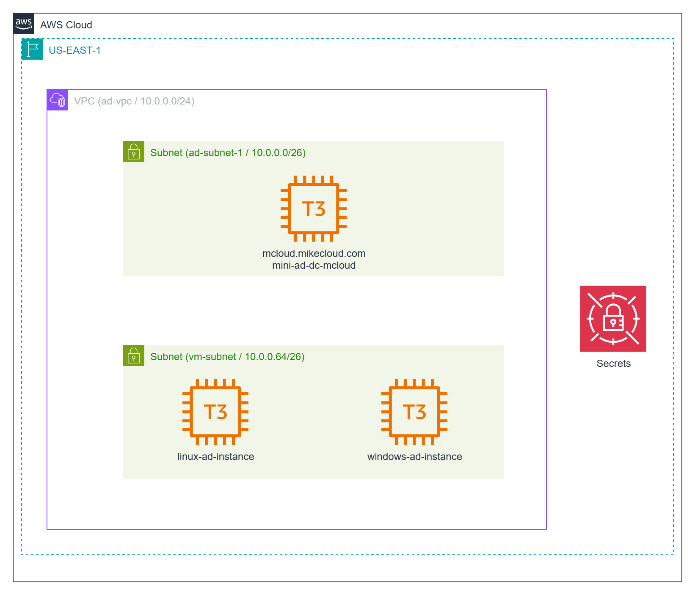
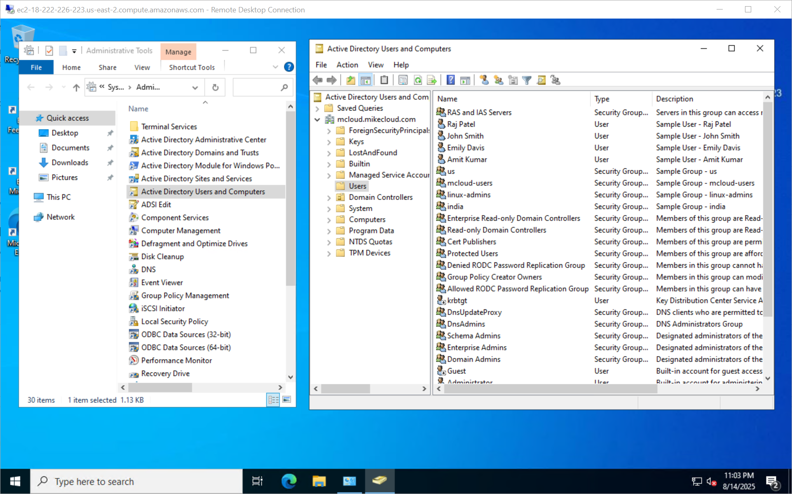
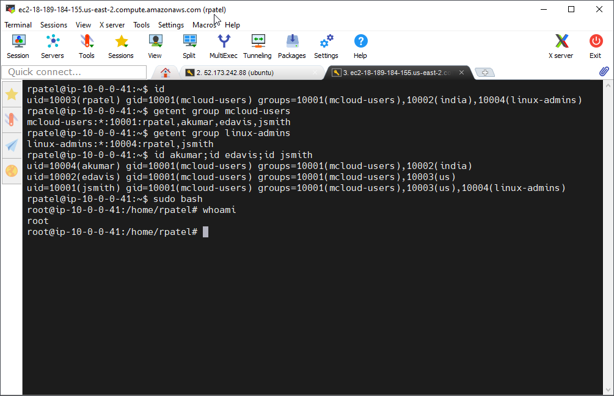

# AWS Mini Active Directory

This project is a follow-up to our full [AWS Managed Microsoft Active Directory deployment video](https://youtu.be/qUc5XQYTRSI). While Managed Microsoft AD is well-suited for production, it can be expensive for prototyping and often requires a significant amount of time to provision. The “mini-ad” approach provides a faster, lower-cost alternative that delivers a fully functional Active Directory environment in minutes.

Using Terraform, Samba 4, and automated configuration scripts, this deployment provisions an Ubuntu-based EC2 instance acting as both a Domain Controller and DNS server. It is integrated into a custom VPC with secure networking, IAM roles, and AWS Secrets Manager for credential management. Windows and Linux EC2 instances are also deployed and automatically join the domain at boot, enabling seamless AD authentication across platforms.

This solution is ideal for labs, demos, and development environments where Active Directory integration is needed without the cost and provisioning time of AWS Managed Microsoft AD. It is **not intended for production use**, but provides a complete, repeatable environment for testing AD-connected workloads in AWS. See the `Limitations` sections for a list of caveats.




## Limitations

While the mini-AD deployment provides a functional and cost-effective Active Directory environment for labs, demos, and development, it does not include many of the advanced features found in AWS Managed Microsoft AD. Below is a list of key capabilities that are missing or require significant manual setup when using mini-AD compared to the managed service:

### Issues Related to PaaS vs IaaS (Operational & Platform-Level)
- **High Availability & Multi-AZ Deployment** – Managed AD provisions redundant DCs automatically; mini-AD is typically a single EC2 instance.  
- **Automated Backups & Snapshots** – Managed AD handles daily backups and point-in-time recovery; mini-AD requires manual backup configuration.  
- **Automatic Patching** – Managed AD auto-patches OS and AD services; mini-AD requires manual updates.  .  
- **Security Hardening & Compliance** – Managed AD is pre-hardened for AWS compliance; mini-AD security depends entirely on your setup.  
- **24/7 AWS Support for Directory Service** – Managed AD includes AWS support; mini-AD requires you to support everything yourself.  
- **Monitoring & Metrics** – Managed AD integrates CloudWatch metrics/logging; mini-AD needs manual monitoring configuration.  

### True Functional Differences (AD Feature Gaps & Compatibility)
- **AWS Service Integration** – Managed AD has built-in integration with WorkSpaces, FSx, RDS SQL Server, QuickSight, etc.; mini-AD may lack or require extra setup.  
- **Group Policy Objects (GPO) Support** – Managed AD provides full, replicated GPO support; Samba GPO support is limited and lacks automatic replication.  
- **PowerShell Active Directory Cmdlet Support** – Managed AD supports full AD PowerShell cmdlets; Samba-based mini-AD lacks native AD Web Services, so cmdlets often don’t work.  
- **Kerberos Trusts with On-Prem AD** – Managed AD supports forest/domain trusts; mini-AD requires complex manual configuration.  

## Prerequisites

* [An AWS Account](https://aws.amazon.com/console/)
* [Install AWS CLI](https://docs.aws.amazon.com/cli/latest/userguide/getting-started-install.html) 
* [Install Latest Terraform](https://developer.hashicorp.com/terraform/install)

If this is your first time watching our content, we recommend starting with this video: [AWS + Terraform: Easy Setup](https://youtu.be/BCMQo0CB9wk). It provides a step-by-step guide to properly configure Terraform, Packer, and the AWS CLI.

---

## Download this Repository

```bash
git clone https://github.com/mamonaco1973/aws-mini-ad.git
cd aws-mini-ad
```

---

## Build the Code

Run [check_env](check_env.sh) to validate your environment, then run [apply](apply.sh) to provision the infrastructure.

```bash
develop-vm:~/aws-mini-ad$ ./apply.sh
NOTE: Validating that required commands are found in your PATH.
NOTE: aws is found in the current PATH.
NOTE: terraform is found in the current PATH.
NOTE: All required commands are available.
NOTE: Checking AWS cli connection.
NOTE: Successfully logged into AWS.
Initializing the backend...
Initializing provider plugins...
- Reusing previous version of hashicorp/random from the dependency lock file
- Reusing previous version of hashicorp/aws from the dependency lock file
- Using previously-installed hashicorp/random v3.7.1
- Using previously-installed hashicorp/aws v5.89.0

Terraform has been successfully initialized!

You may now begin working with Terraform. Try running "terraform plan" to see
any changes that are required for your infrastructure. All Terraform commands
should now work.
```

---

### Build Results

When the deployment completes, the following resources are created:

- **Networking:**  
  - A VPC with public and private subnets  
  - Internet Gateway and NAT Gateway for controlled outbound access  
  - Route tables configured for both public and private subnets  

- **Security & IAM:**  
  - Security groups for domain controller, Linux client, and Windows client  
  - IAM roles and policies allowing EC2 instances to use AWS Systems Manager and retrieve credentials from AWS Secrets Manager  

- **Active Directory Server:**  
  - Ubuntu EC2 instance running Samba 4 as a Domain Controller and DNS server  
  - Configured Kerberos realm and NetBIOS name  
  - Administrator credentials stored in AWS Secrets Manager  

- **Client Instances:**  
  - Windows Server EC2 instance joined to the domain  
  - Linux EC2 instance joined to the domain with SSSD integration  

---

### Users and Groups

As part of this project, when the domain controller is provisioned, a set of sample **users** and **groups** are automatically created through Terraform-provisioned scripts running on the mini-ad server. These resources are intended for **testing and demonstration purposes**, showcasing how to automate user and group provisioning in a self-managed Active Directory environment.


#### Groups Created

| Group Name    | Group Category | Group Scope | gidNumber |
|---------------|----------------|-------------|-----------|
| mcloud-users  | Security       | Universal   | 10001     |
| india         | Security       | Universal   | 10002     |
| us            | Security       | Universal   | 10003     |
| linux-admins  | Security       | Universal   | 10004     |

#### Users Created and Group Memberships

| Username | Full Name   | uidNumber | gidNumber | Groups Joined                    |
|----------|-------------|-----------|-----------|-----------------------------------|
| jsmith   | John Smith  | 10001     | 10001     | mcloud-users, us, linux-admins    |
| edavis   | Emily Davis | 10002     | 10001     | mcloud-users, us                  |
| rpatel   | Raj Patel   | 10003     | 10001     | mcloud-users, india, linux-admins |
| akumar   | Amit Kumar  | 10004     | 10001     | mcloud-users, india               |

---

#### Understanding `uidNumber` and `gidNumber` for Linux Integration

The **`uidNumber`** (User ID) and **`gidNumber`** (Group ID) attributes are critical when integrating **Active Directory** with **Linux systems**, particularly in environments where **SSSD** ([System Security Services Daemon](https://sssd.io/)) or similar services are used for identity management. These attributes allow Linux hosts to recognize and map Active Directory users and groups into the **POSIX** (Portable Operating System Interface) user and group model.

---

### Log into Windows Instance  

When the Windows instance boots, the [userdata script](02-servers/scripts/userdata.ps1) executes the following tasks:  

- Install Active Directory Administrative Tools  
- Install AWS CLI  
- Join EC2 instance to Active Directory  
- Grant RDP access to domain users  
- Perform a final system reboot  

Administrator credentials are stored in the `admin_ad_credentials` secret.



---

### Log into Linux Instance  

When the Linux instance boots, the [userdata script](02-servers/scripts/userdata.sh) runs the following tasks:  

- Update OS and install required packages  
- Install AWS CLI  
- Join the Active Directory domain with SSSD  
- Enable password authentication for AD users  
- Configure SSSD for AD integration  
- Grant sudo privileges to the `linux-admins` group  

Linux user credentials are stored as secrets.



---

### Clean Up Infrastructure  

When you are finished testing, you can remove all provisioned resources with:  

```bash
./destroy.sh
```

This will use Terraform to delete the VPC, EC2 instances, IAM roles, security groups, and any other infrastructure created by the project. Secrets stored in AWS Secrets Manager will also be deleted unless retention policies are configured.
